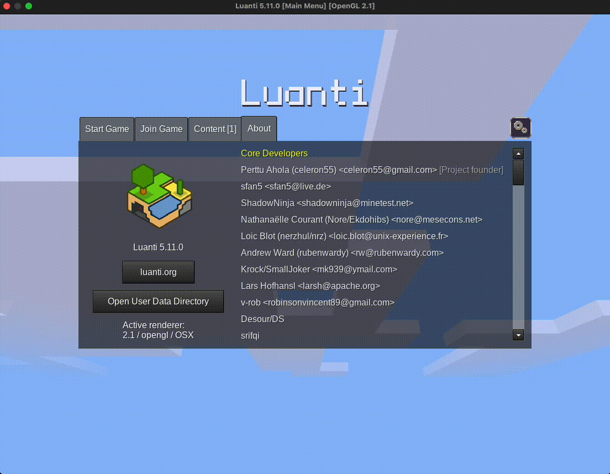

# Usage Instructions for `lsqecc_slicer` with Minetest Option

## 1. Introduction

The `lsqecc_slicer` is a C++ Library implementing some tools for the [Lattice Surgery Compiler](https://github.com/latticesurgery-com/liblsqecc). The [`minetest` option](https://github.com/chenxu2394/liblsqecc/) has been added to generate a `map.sqlite` file for use with Minetest.

## 2. Prerequisite

The code has been tested on the minetest(luanti) of verion 5.11.0, on macOS 15.3.1 and Ubuntu 24.04.2 LTS.

The map version is 29 according to the [minetest documentation](https://github.com/luanti-org/luanti/blob/master/doc/world_format.md)

## 3. Usage Instruction

### 3.1. Create a New Game Using SingleNode Mode



### 3.2. Locate and Modify the `minetest.conf` File

On macOS, the `minetest.conf` file is located at `~/Library/Application Support/minetest/`


Update its content to include the following:

```conf
#    The privileges that new users automatically get.
#    See /privs in game for a full list on your server and mod configuration.
#    type: string
default_privs = interact, shout, privs, basic_privs, fly

time_speed = 0
```

This configuration grants the player fly privileges and freezes the game time.

### 3.3. Generate the `map.sqlite` File

#### 1. Clone the Repo and Build the Code

```bash
git clone --recursive git@github.com:chenxu2394/liblsqecc.git
cd liblsqecc
cmake -S . -B build
cmake --build build -- -j
```

#### 2. Run the Code with the `--minetest` Option

The `stripheight` option inserts gaps between slices for easier inspection.

```bash
./build/lsqecc_slicer -q -i ./regression_tests/cases/edpc_t_layers/t_layer_100qubits.qasm -L edpc --nostagger --local -P wave --minetest --stripeheight 3
```

The generated `map.sqlite` file will be created in the root directory of the repository.

### 3.4. Copy the `map.sqlite` File to the Minetest World Folder


### 3.5. Start the Minetest Game

The structure can be found near the origin of the world.


